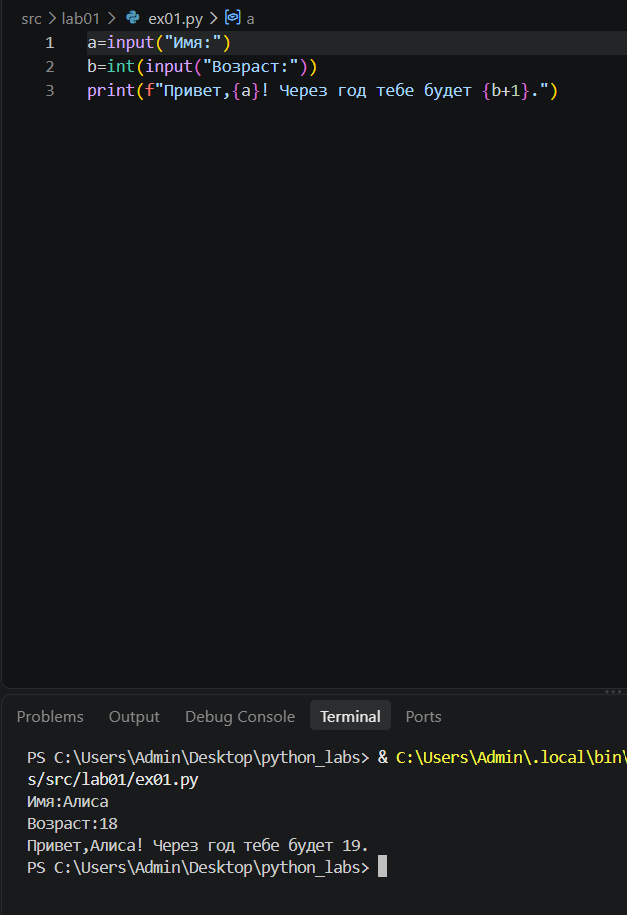
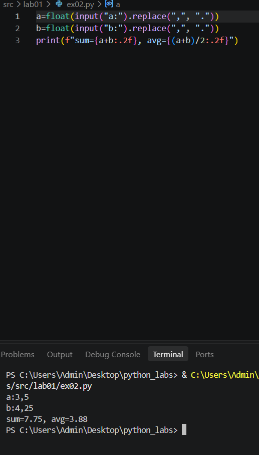
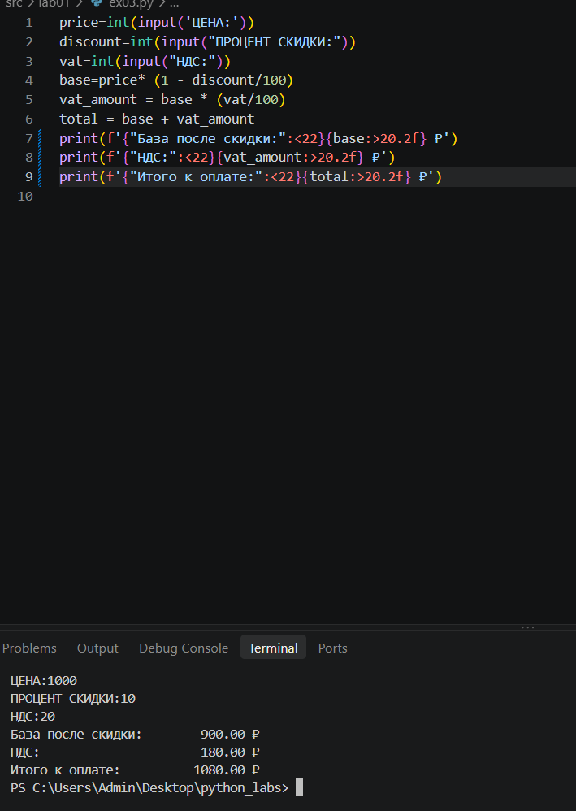
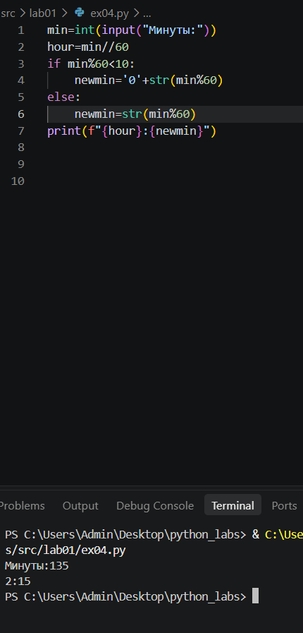
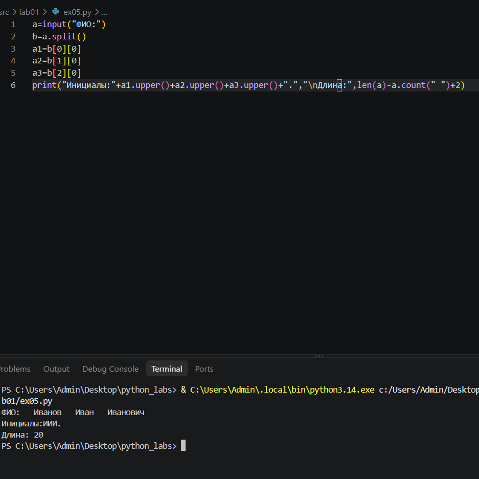

# Python Labs

## Скриншоты

**№1**
**Имя(строка) возраст(целое число)**

**№2**
**float ради дробных и replace чтобы с "," тоже работало**

**№3**

**№4**
**если минут<10 писало 0 перед временнем**

**№5**
**команда split() разделяет ,а потом я смотрю каждое слово по отдельности и делаю их заглавными, 
также считаю длинну всех символов и отнимаю кол-во пробелов и прибавляю 2 которые должны быть**

