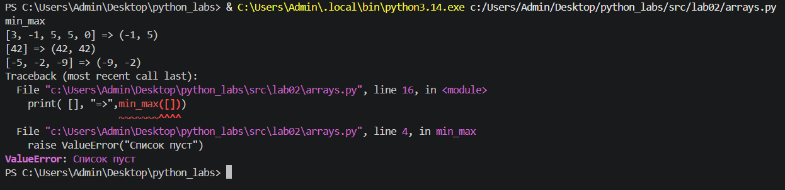
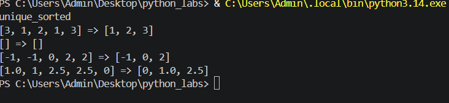
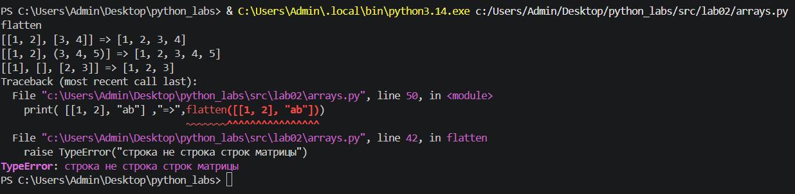
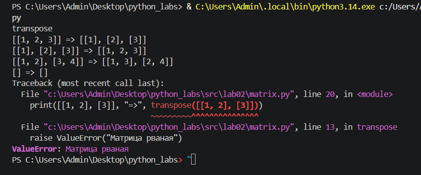

# Лабораторная работа №2

## Задание 1 — min_max

Функция `min_max` возвращает минимальное и максимальное значение из списка.

## Задание 2 — unique_sorted

Функция `unique_sorted` удаляет повторяющиеся элементы и возвращает отсортированный список уникальных значений.

## Задание 3 — flatten

Функция `flatten` «расплющивает» вложенные списки и кортежи в один список.

## Задание B — 'matrix.py'

# transpose

Функция `transpose` меняет строки и столбцы местами. Пустая матрица [] → [].
Если матрица «рваная» (строки разной длины) — ValueError

# row_sums

Функция `row_sums` суммирует по каждой строке. Требуется прямоугольность

# Col_sums

Функция `col_sums` суммирует по каждому столбцу. Требуется прямоугольность

